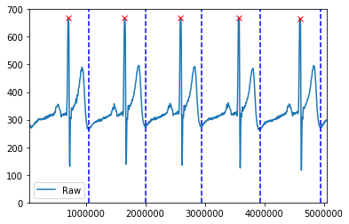
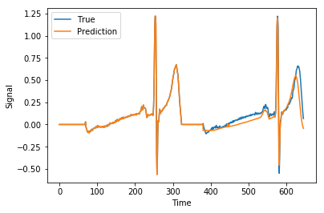
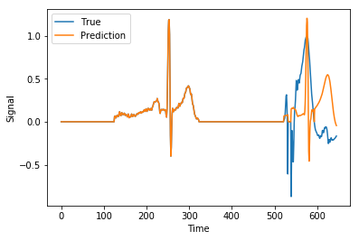

# PULSE-MONITOR
Concept work for a heart beat monitor to predict intermittent PVC arrhythmia. 

This work is currently ongoing. Primarily the focus is on data acquisition, in order to build a sufficiently large dataset to work with.
Due to the nature of measured intermittent arrhythmia, a large class imbalance in the measurement data is present, at about 1:2000.

# Basic concept:
The idea of this project is to measure heart rythm by means of a ~~IR~~ AD8232 ECG based pulse sensor and predict the onset of premature ventricular contractions based on the last few measured heart-beats. 

A prediction model was initially built based on a tensorflow RNN, e.g. LSTM cells, based on various length signal input to accurately capture varying bpms. Due to the computational expense of learning based on time series input as well as output, the model will likely be adapted to use time-deltas and amplitudes as input, rather than raw measurements.

The trained model should then be capable of using live measurement data to accurately predict The onset of PVCs in the following heart-beats.

The main challenges are the following:

- [X] Data acquisition concept
- [X] Automatic data splitting into single or multiple beats (revision may be required for more robustness)
- [ ] Model training in tensorflow --> Google Colab (possible but computationally very expensive in current setup)
- [ ] Model translation for live interpretation (e.g. tflite/EdgeTPU)

Currently three scenarios are envisioned.

1. DAQ runs through a Arduino Nano, routing data by serial to Raspberry Pi for splitting, processing and storing.
1. ~~DAQ runs directly through the Raspberry Pi by means of GPIO, effectively removing the Nano fromt he~~ chain.
1. ~~DAQ and processing run through the Nano, with dedicated SD storage extension shield.~~

## Example of signal splitting



## Example prediction based on variable LSTM input and output length


## Early (failed) example of PVC detection


## Open Topics / Concept issues
* <del>Serial read frequency (DAQ and transfer should be min ~50Hz)</del>
* <del>Time stamp reset / roll-over check?</del>
* <del>Unstable/nonrobust serial communication between Pi and Uno</del>
* Tensorflow lite model transfer (CPU/GPU --> ARM --> TPU)
* <del>Sensor setup on PI/Nano</del>
* <del>Beat splitting method, may need improvement</del>
* <del>Buffering</del>

## Software/Hardware build versioning

### Raspberry Pi:
**system**
```
Raspberry Pi Model 3 B+
Raspbian GNU/Linux 9.9
Kernel 4.19.42-v7+
```

**python**
```
absl-py==0.7.1
astor==0.8.0
attrs==19.1.0
backcall==0.1.0
bleach==3.1.0
cycler==0.10.0
Cython==0.29.9
decorator==4.4.0
defusedxml==0.6.0
entrypoints==0.3
future==0.17.1
gast==0.2.2
grpcio==1.21.1
h5py==2.9.0
ipykernel==5.1.1
ipython==7.6.1
ipython-genutils==0.2.0
ipywidgets==7.5.0
iso8601==0.1.12
jedi==0.14.0
Jinja2==2.10.1
joblib==0.13.2
jsonschema==3.0.1
jupyter==1.0.0
jupyter-client==5.3.0
jupyter-console==6.0.0
jupyter-core==4.5.0
Keras-Applications==1.0.8
Keras-Preprocessing==1.1.0
kiwisolver==1.1.0
Markdown==3.1.1
MarkupSafe==1.1.1
matplotlib==3.1.0
mistune==0.8.4
mock==3.0.5
nbconvert==5.5.0
nbformat==4.4.0
notebook==5.7.8
numpy==1.16.4
pandas==0.24.2
pandocfilters==1.4.2
parso==0.5.0
PeakUtils==1.3.2
pexpect==4.7.0
pickleshare==0.7.5
prometheus-client==0.7.1
prompt-toolkit==2.0.9
protobuf==3.8.0
ptyprocess==0.6.0
Pygments==2.4.2
pyparsing==2.4.0
pyrsistent==0.15.3
pyserial==3.4
python-dateutil==2.8.0
pytz==2019.1
PyYAML==5.1.1
pyzmq==18.0.2
qtconsole==4.5.1
scikit-learn==0.21.2
scipy==1.3.0
Send2Trash==1.5.0
serial==0.0.97
six==1.12.0
sklearn==0.0
tensorboard==1.13.1
tensorflow==1.13.1
tensorflow-estimator==1.13.0
termcolor==1.1.0
terminado==0.8.2
testpath==0.4.2
tornado==6.0.3
traitlets==4.3.2
wcwidth==0.1.7
webencodings==0.5.1
Werkzeug==0.15.4
widgetsnbextension==3.5.0
```

### Arduino:
**system**
```
Arduino Uno R2
ATMega328P-PU
```

**system**
```
C-Control Nano
ATMega328
```

**system**
```
Arduino Micro
ATMega3204
```

**Arduino  IDE**
```
2:1.0.5+dfsg2-4.1
1.8.9 local
```

# LOG

## 03.12.2019
More measurement data. Power-bank gave up at some point. ~80 events total logged.

## 12.10.2019
More measurement data. Total of 51 events recorded. Possibly enough for feasibiliuty check?

## 30.09.2019
Fixed dates in README.
* Cleaning raw and sample data from repo to reduced total repo size.
* Removed csv / png from tracking with gitignore
* Running BFG on all csv / png and replacing non raw/sample files from backup
* Seems to have worked! Repopulating with raw and sample data (UNTRACKED!)

## 27.08.2019
Trying to preprocess from peak to peak (regular heart beat), and stretching to fixed width.

## 26.08.2019
Preprocessing more recorded data according to -60 +120 around peak. Still not convinced this is the best method. Fixed width is too restrictive.

## 22.08.2019
Recoded 1h of data. Prepared overview plot for visualization.

## 21.08.2019
Installed ST7735S into case. Recorded 2h of data.
* Pi hooked up to cellphone charger doesn't seem to work. Only hooked up to power-bank signals are clean.
* Status LED doesn't respond anymore? To be tested on serial monitor. Possible delay required in python code.

## 19.08.2019
Hooked up ST7735S TFT screen to arduino. Plotting seems to work while keeping 200Hz sampling with Adafruit libraries. 
* Plotting failry clean with noise only. To be tested with real ECG sensors.

## 16.08.2019
Tried hooking up 0.96 OLED 1306 screen. Only every second line shows up. Board likely broken (glass chipped in corner).
* Adjusted Uno code to read signal and time into variables

## 29.07.2019
Built enclosure for AD8232 and Uno.
* Adjusted delay to 0.5 after reset for indicator LED
* Preprocessing data with peak -60 +120 samples fixed length as alternative

## 27.07.2019
Recording a bit noisey, interference from somewhere...
* Added status indication LED to arduino. Blue LED on indicates recording.
* Added self quit after 1000 errors.
* Recorded 6 x 10min

## 22.07.2019
Reworked test and training sets.
* Aligned right, with 1 beat input and 1 beat output.
* Residual loss at ~0.6% at 100 epochs.
* Prediction on training and testing looks ok, likely needs a lot more data for better loss values.
* PVC detection as a concept would definitely work!

## 20.07.2019
Combined available data into training and testing. Should be possible to start training on Google COLAB!
* Moved data to Google Drive for faster access.
* GPU LSTM works! Setup generally seems fine and visualization makes sense.
* Normalized data for faster convergence, but can't get below ~46% loss.
* Alternate idea, use single beat input for single beat target, aligned at right (peak position the same for all).

## 19.07.2019
Fixed time stamp rest.
* Issuing DTR pin reset to Arduino before starting
* Sleeping for 0.022s, aparently what UI/IDE does as well
* Skipping first 5 empty rows
* To be tested with 10min actual measurement
* Max measurement interval should not exceed ~71min, limiting to segments of 10min should be no issue

## 18.07.2019
Further development of processing chain.
* Peak detection works on other data as well.
* Splitting tested for peak+70samples (~0.35s) at resting heart rate.
* Splitting could potentially be improved at bottom peak, e.g. lowest peak ~40-80 samples after highest peak.
* Prepared all of the up-to-now recorded data into single peak samples (~7400). First ML RNN model can be fed with this.
* Combine events with following peak for consistency? Following peak strongly influenced in length by event using 70 sample cut. Keeping as is for now for first testing.

## 17.07.2019
Time stamp reset seems too buggy, has been removed. 
* <del>Switched from micros() to millis() due to rollover issue after 71min. millis() sould be fine for ~50days.</del>
* Recorded 2x 10min with millis(). Signals good, no significant issues. Time stamp may be of by 10% though...
* Recorded additional 6x 10min. Some interference seems present. Possibly cell phone?
* Fixed micros() with roll over, by switching to next_read and delta checking. Seems feasible. Will ignore time-stamp except for frequency checking and consistency.

## 16.07.2019
Second try at long term monitoring. Recorded 2x 35min, but without writing out file. Manual separation in abort.csv worked.
* Clean signals for about 70min total
* Manual cleaning still required
* Will try breaking files into 10min increments --> seems to work, recorded 2x 10min. Trying more tomorrow

## 15.07.2019
First peak detection started for further processing.
* Fixed arduino code to start recording at ~0s (flush and delay)
* Included peak detection concept in notebook

## 12.07.2019
Attached AD8232 ECG sensor as an alternative to KY039. 
* Basic setup based on [Sparkfun guide](https://learn.sparkfun.com/tutorials/ad8232-heart-rate-monitor-hookup-guide/all).
 * Yellow: left arm
 * Red: right arm
 * Green: left leg
* Switched to 57600baud for consistency.
* Reduced to 200Hz DAQ
* STRONG interference of 50Hz from TV/monitor... may require shielding?
* AD8232 requires time to recenter, may not be feasible for being active?
* Nano has issues uploading
* Micro shows same 50Hz issue

## 09.07.2019
Second attempt at reading 60min. Failed at around 2150s (from 3600s). Needs further debugging/file splitting.
* Started development notebook.
* Rolling mean (5-window) reduces noise significantly.
* Peak finding can be tested on data set.

## 08.07.2019
First 60min recording failed.
* Added monitoring print out, and abort saving.

## 04.07.2019
Facing some issues getting the serial communication synced and without mistransmissions.
* Play around with ser.flush(), time.sleep() and timeout settings.
* Added shell script for removing old *.csv files
* Saving files according to start date and time

## 02.07.2019
Added start/stop commands to UNO ("S" Start, "T" Terminate).
* Switched to 3.3V supply on sensor. resolution seems far better.
* Switched to Arduino IDE 1.8.9 for serial plotting support.

## 22.06.2019
Added KY039HS pulse sensor to replace EZ1. Additional code development.
* Ramped sampling rate up tp 200Hz
* Ramped up serial baud rate to 56.6k
* Added initial plotting tool for saved test data
* Added sensor documentation

## 10.06.2019
Set up basic serial communication between Arduino **Uno** (for testing/prototyping purposes) and Pi.
* Restructured project folder
* Using EZ1-Range Finder sensor for testing
* Implemented try/catch on Pi side to limit communcation issues... further testing and development needed
* Set sampling frequnecy to 50Hz

## 01.06.2019
Starting basic setup work for Arduino **Nano** (C-Control compatible board) and Raspberry **Pi** 3 B+.
* Added "blink" example as placeholder to Nano
* Set up python 3.7.3 on Pi

